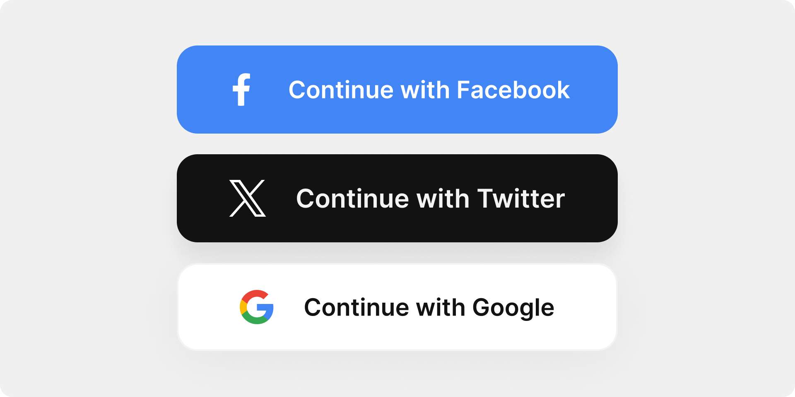
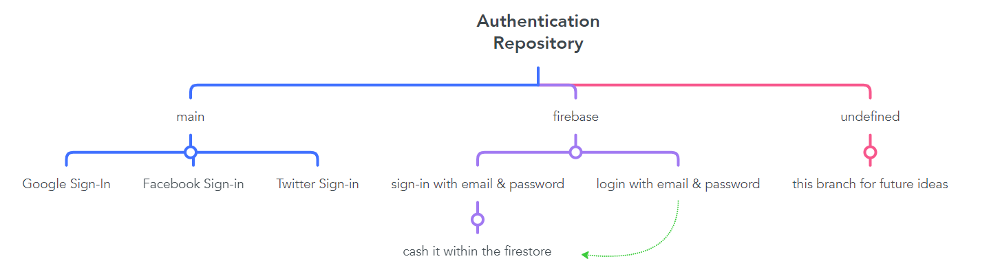

# Authentication
 Unlock the potential of Google, Facebook, Twitter, and Firebase sign-ins seamlessly integrated with Bloc state management. Fortify security, streamline user experience, and empower your app with cutting-edge authentication. 🚀🔐

# Content

### Let's Dive Into the Main

## Google Sign-In Implementation without Firebase
### Introduction

This guide provides step-by-step instructions on implementing Google Sign-In in your application without relying on Firebase. By following these steps, you can seamlessly integrate Google authentication into your app

### Steps

1. Add Dependencies
Make sure to include the required dependencies in your `pubspec.yaml` file:
```yaml
dependencies:
  google_sign_in: ^6.2.1
```
Run `flutter pub get` to fetch the new dependencies.
2. Configure OAuth2.0
   - Visit the [Google Cloud Console](https://console.cloud.google.com/welcome/new).
   - Create a new project or select an existing one.
   - Navigate to the "Credentials" page.
   - Click on "Create Credentials" and choose "OAuth client ID"
   - Select "IOS application" as the application type.
> Note we will make 2 Credentials IOS and Android
### IOS Setup
- Select “iOS” under the Application Type dropdown.
- We have to enter a Name. You write whatever you want but I suggest to you write “iOS Oauth”.
- Also we have to enter a “Bundle ID” which is located in “ios/Runner/Info.plist” under the “CFBundleIdentifier” tag.
- Click the “Create” button!
- Info.plist, add these lines of code
```plist
<array>
 <dict>
  <key>CFBundleTypeRole</key>
  <string>Editor</string>
  <key>CFBundleURLSchemes</key>
  <array>
   <string>***IF YOU HAVE FACEBOOK SIGN IN CLIENT ID, TYPE HERE***</string>
   <string>com.googleusercontent.apps.***YOUR_CLIENT_ID***</string>
  </array> 
 </dict>
</array>
```
### Android Setup
We need to have more than one OAuth Client ID because we require a different ‘SHA-1 Certificate Fingerprint’ for each device on the Android side. This is necessary for both debug mode (for running on emulators and testing code) and release mode (for generating apk/aab files).
- Select “Android” under the Application Type dropdown.
- We have to enter a Name. You write whatever you want but I suggest to you write for debugging environment “Android OAuth Debug” and for release environment “Android OAuth Release”
- Get debug SHA-1 and release SHA-1
  - Go to project terminal and open android folder (cd android)
  - Write “./gradlew signInReport”. (This gives us the SHA1 keys in our project)
  - We come across a lot of information that includes SHA-1 and SHA-256. We search for the SHA-1 keys with the “Variant” and “Config” values set to “debug”
- Now, go to your project and find build.gradle in android folder and find dependencies. Then, add this line of code.
```groovy
   dependencies {
    classpath 'com.google.gms:google-services:4.4.0'
}
```
- Then go to build.gradle in android/app and find dependencies again. Then, add this line of code.
```groovy
dependencies {
    implementation 'com.google.android.gms:play-services-auth:20.7.0'
}
```
- Finally, you are ready to go!
4. Implementation
```dart
  final GoogleSignIn _googleSignIn = GoogleSignIn(scopes: ['email']);

  @override
  Future<User> signInWithGoogle() async {
    try {
      final GoogleSignInAccount? googleAccount = await _googleSignIn.signIn();
      if (googleAccount != null) {
        final GoogleSignInAuthentication googleAuthentication =
            await googleAccount.authentication;

        return User(
          name: googleAccount.displayName,
          email: googleAccount.email,
          picture: googleAccount.photoUrl,
        );
      }
    } catch (error) {
      print("Error during Google Sign-In: $error");
    }
    return User.empty();
  }
```
for better understanding head to [Authentication Folder](lib/authentication)

